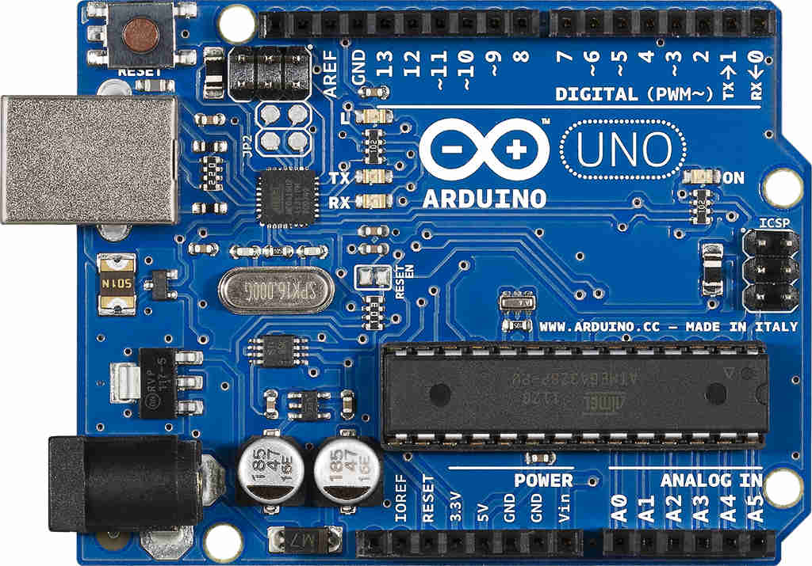

# arduino

Personal projects with arduino. Contains *.ino* arduino code and some *SolidWorks* parts and drawings. Some projects have pictures or videos of the result.

Feel free to copy the code and share your project!

---
**Table of Contents:**

- [arduino](#arduino)
  - [Button](#button)
  - [Lights](#lights)
  - [Motor](#motor)
  - [Motor Mount](#motor-mount)
  - [Materials](#materials)

---

## Button

## Lights

## Motor

- TODO

## Motor Mount

- TODO

## Materials

| Product | Image |
| :-- | :-: |
| [Arduino Uno](https://store-usa.arduino.cc/collections/boards/products/arduino-uno-rev3) |  |
| [Smraza Basic Wire Pack](https://www.amazon.com/gp/product/B01HRR7EBG/ref=ppx_yo_dt_b_search_asin_title?ie=UTF8&psc=1) |  |
| [Plusivo Soldering kit](https://www.amazon.com/dp/B07S61WT16?psc=1&ref=ppx_yo2_dt_b_product_details) |  |
